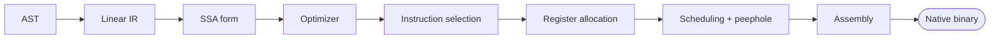

# Compiler Backend From Scratch

I kept running into the same problem when I was learning compilers: every tutorial
spends ages on lexing and parsing, gets you to an AST, and then waves its hands at
"and then you generate code." The interesting part, the part that turns a tree into
fast machine code, is usually left as an exercise.

So this is that exercise, written out. It's a chapter-by-chapter walkthrough of an
optimizing compiler backend in C++17. You start with an IR and end with x86-64
assembly that actually assembles and runs.

It assumes you can read C++ and have seen an AST before. It does not assume you know
what a dominance frontier is, or how register allocation works. We build all of that.

## What's the target?

x86-64, using the System V AMD64 ABI (so Linux and macOS). I picked it because it's
what most people can run locally without an emulator. There's an AArch64 track planned
once the x86-64 path is solid, but it's not here yet.

## The shape of the thing

Here's everything we build and how it fits together:



## Chapters

| #  | Topic | What you'll have built |
|----|-------|------------------------|
| 01 | [From an AST to a linear IR](chapters/01-linear-ir) | The IR types, a builder, and a printer |
| 02 | SSA form | Dominance, dominance frontiers, phi insertion |
| 03 | A dataflow framework | A reusable worklist solver over lattices |
| 04 | Optimizations | Constant folding, SCCP, DCE, GVN, LICM |
| 05 | Instruction selection | Going out of SSA, then tiling to machine ops |
| 06 | Register allocation, part 1 | Linear scan with spilling |
| 07 | Register allocation, part 2 | Graph coloring (Chaitin-Briggs) |
| 08 | Scheduling and peephole | A list scheduler and a peephole pass |
| 09 | Emitting code | The ABI, stack frames, real assembly |
| 10 | Putting it together | The whole pipeline on one program |

Chapters 02 onward land as I write them. Each chapter folder is small on purpose: a
`README.md` with the lesson, a header with the code, and a `main.cpp` that builds a
small example and checks itself. You should be able to read one in a sitting.

## Building

You just need a C++17 compiler. Each chapter compiles on its own, for example:

```sh
cd chapters/01-linear-ir
g++ -std=c++17 -Wall main.cpp -o ch01
./ch01
```

## License

MIT, see [LICENSE](LICENSE).
