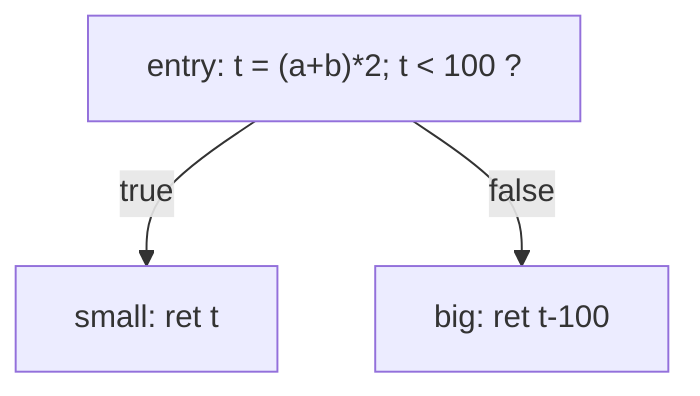

# Chapter 1: from an AST to a linear IR

Before optimizing anything or generating code, we need something to work on. That's
the IR, and this chapter builds it.

An AST is a tree, and trees are awkward for the dataflow and code generation that
come later. So the first thing a backend does is flatten the tree into a straight
list of simple instructions, grouped into basic blocks. No optimization here, no
machine code yet, just a representation we'll live in for the next few chapters.

## What it looks like

A three-address IR. "Three-address" means each instruction does one operation with
at most two inputs and one output, so `t = a + b` instead of a nested expression:

```
fn f(i64 %a, i64 %b) -> i64 {
entry:
  %t0 = add %a, %b
  %t1 = mul %t0, 2
  %t2 = icmp lt %t1, 100
  condbr %t2, small, big
small:
  ret %t1
big:
  %t3 = sub %t1, 100
  ret %t3
}
```

Things to notice:

- A function is a list of basic blocks (`entry`, `small`, `big`).
- A basic block is a straight run with no branches in the middle. Control enters at
  the top and leaves at the bottom.
- The last instruction of every block is a terminator (`br`, `condbr`, `ret`).
- Constants like `2` and `100` are inline operands, not separate instructions.

The blocks and branches form the control-flow graph:



We'll be reading CFGs constantly from the next chapter on, so it's worth getting
used to them now.

## The code

It's two files. [ir.h](ir.h) has the whole IR; [main.cpp](main.cpp) builds the
function above and prints it.

The data model is small:

- `Value` is the base of anything an instruction can use: a `Constant`, an
  `Argument`, or another `Instruction`. Sharing one base means an operand is just a
  `Value*` and we don't branch on the kind everywhere.
- `BasicBlock` is an ordered list of instructions and knows its terminator.
- `Function` owns all the storage in `unique_ptr` pools; everything else points
  into it, so references stay valid as we build.

You don't make instructions by hand, the `IRBuilder` does, naming temporaries for
you. Building the example is just:

```cpp
B.setBlock(entry);
Value *t = B.mul(B.add(a, b), B.constant(2));
B.condBr(B.icmpLt(t, B.constant(100)), small, big);
```

One thing to flag: this IR is **not** in SSA form. A value could be assigned more
than once and there are no phi nodes. SSA is what makes the later optimizations
clean, so it's the very next chapter. Starting without it makes the reason for it
obvious once we get there.

## Build and run

```sh
g++ -std=c++17 -Wall main.cpp -o ch01
./ch01
```

## Try it yourself

- Add a `div` opcode end to end: the enum, `opName`, a builder helper, and the
  printer.
- Write a `verify(const Function&)` that checks every block ends in exactly one
  terminator and nothing follows it.
- Add a `predecessors(BasicBlock*)` helper. Successors live on the terminator;
  predecessors you have to compute. You'll want this in chapter 2.
