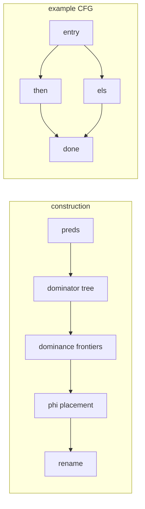

# Chapter 2: SSA form

Chapter 1 ended on a confession: the IR wasn't in SSA form. Every temporary the
builder made was defined once, which looked like SSA, but that was only because
the builder never reassigned anything. Real input does. A loop counter, a
variable updated inside an `if`, an accumulator: all of them get written more
than once. This chapter takes a function whose blocks reassign named variables
and rewrites it so each definition is unique, inserting phi nodes where control
paths merge.

## Why bother

SSA (static single assignment) means every value is assigned in exactly one
place. The payoff is that "where was this defined?" has a single answer instead
of "it depends which branch you came through." Constant propagation, dead code
elimination, value numbering, all of the chapter 4 passes get much simpler once
a use points at one unambiguous definition. So it's worth paying the
construction cost up front.

The hard part is merges. Take a variable written on both sides of an `if` and
read afterward:

```
entry:
  c   = a + b
  cmp = a < b
  condbr cmp, then, els
then: m = b ; br done
els:  m = a ; br done
done:
  r = m + c
  ret r
```

Which `m` does `done` read? Neither one alone. SSA answers this with a phi: a
pseudo-instruction at the top of `done` that picks `m` from `then` or `m` from
`els` depending on the edge taken. After construction it reads

```
done:
  m.2 = phi i64 [m.1, then], [m.0, els]
  r.0 = add m.2, c.0
```

The whole chapter is really one question: at which blocks do we need a phi, and
for which variables? Putting a phi at every block for every variable would be
correct but enormous. The minimal answer is the dominance frontier.

## Dominators and frontiers

Block `d` *dominates* block `n` if every path from entry to `n` goes through
`d`. The immediate dominator `idom(n)` is the closest such block above `n`, and
those edges form the dominator tree.

The dominance *frontier* of `b` is the set of blocks where `b`'s dominance just
runs out: blocks that `b` does not dominate but that have a predecessor `b` does
dominate. That phrasing sounds fussy, but it's exactly the join-point test. If a
variable is defined in `b`, then `b`'s definition reaches into the start of
every block on its frontier, where it collides with whatever came down the other
edge. That collision is what a phi resolves. So: a definition in `b` forces a
phi at every block in the frontier of `b`. Placing that phi is itself a new
definition, so you iterate to a fixpoint (the iterated dominance frontier).

Here is the pipeline, with the example's CFG on the right:



In the example, `done` is the only block with two predecessors, so it's the only
block on anyone's frontier: `DF(then) = DF(els) = {done}`. The variable `m` is
defined in `then` and `els`, so it gets a phi at `done`. The variable `c` is
defined once in `entry`, which dominates its use in `done`, so its definition
reaches the use directly and it needs no phi. That's the whole point of using
frontiers instead of brute force: you only pay for the merges that actually
happen.

## The code

[ssa.h](ssa.h) is the stage; [main.cpp](main.cpp) builds the function above,
prints it before and after, and checks the result. The data model is a little
different from chapter 1 on purpose: blocks hold `Assign`s that write named
`Variable`s, because the input is *not* SSA yet. That's the thing we're
converting.

`toSSA` runs five steps in order, each a short function in the header:

1. `computePreds` inverts the successor edges. Successors are on the terminator;
   predecessors you have to build.
2. `computeDominators` is the Cooper-Harvey-Kennedy "simple, fast" algorithm:
   number blocks in postorder, then iterate `idom[]` to a fixpoint with an
   `intersect` that walks two nodes up their idom chains until they meet. It's
   maybe twenty lines and it's the part I'd most encourage you to step through.
3. `computeDominanceFrontiers` is the five-line loop from the same paper: for
   each join, walk from each predecessor up to the join's idom, marking the join
   on every runner's frontier.
4. `insertPhis` does Cytron's worklist over the iterated frontier, one variable
   at a time, dropping empty phis at the chosen blocks.
5. `renameVariables` walks the dominator tree keeping a stack per variable. The
   top of the stack is the definition that reaches here; reads resolve to it,
   writes push a fresh name, and on each outgoing edge we copy the current name
   into the successor's phi slot for this predecessor.

The phi operands are filled in during renaming, not placement, which trips
people up at first: you place an empty phi knowing only its block, and you don't
learn what flows into each slot until the rename walk reaches the predecessor.

## Build and run

```sh
g++ -std=c++17 -Wall -Wextra main.cpp -o ch02
./ch02
```

It prints the function before and after construction and then runs a handful of
asserts on the dominator tree, the frontiers, and the single phi at `done`.

## Try it yourself

- Add a loop. Give `entry` a back edge so a variable is defined before the loop
  and again inside it. A loop header has two predecessors, so it lands on a
  frontier and gets a phi. Watch the iterated part of the frontier do its job.
- Print the dominator tree. You already store `idom` and `domChildren`; a short
  recursive printer makes the structure concrete and is good for debugging.
- The phis we place are "pruned" only by frontiers, not by liveness. Add a
  variable that's defined on both branches but never read after the join and
  confirm we still place a (dead) phi for it. Then, for extra credit, skip phis
  for variables not live at the join. That's the difference between minimal and
  pruned SSA.
- We never destruct SSA back out. Real backends eventually replace phis with
  copies on the incoming edges before register allocation. Sketch what `done`'s
  phi becomes as two `copy`s, one at the end of `then` and one at the end of
  `els`.
