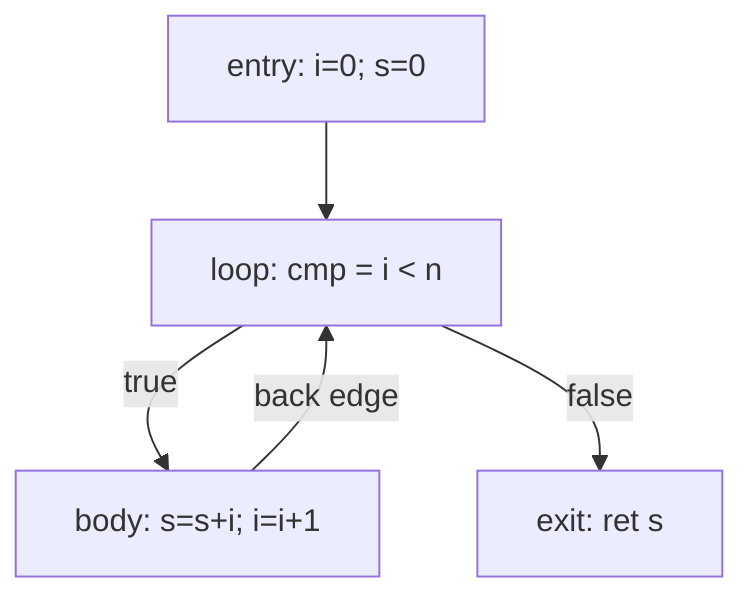

# Chapter 3: a dataflow framework

We already wrote a dataflow analysis in chapter 2 and didn't call it one. The
dominator computation initialized every block, then swept the CFG combining
information from neighbors and repeating until a pass changed nothing. That loop
is the whole pattern. It shows up again for liveness, reaching definitions,
available expressions, constant ranges, and most of the chapter 4 optimizations.
So instead of hand-rolling the fixpoint each time, this chapter writes it down
once as a solver and then feeds it a real analysis.

## The four pieces

Every analysis I care about decomposes the same way. If you can fill in these
four blanks, the solver is identical:

- **Direction.** Do facts flow forward from entry (what's true *before* this
  point, given how we got here) or backward from the exits (what will be needed
  *after* this point)? Liveness is backward. Reaching definitions is forward.
- **The fact.** Whatever you track at a program point: a set of live variables,
  a map from variable to known constant, a bitvector of available expressions.
  It needs value semantics and an equality test so the solver can notice when it
  stops moving.
- **Meet.** How to combine facts where two edges come together. Union if "true
  on *any* path" is what you want (liveness), intersection if you need "true on
  *all* paths" (available expressions). Meet has an identity, which I call
  `top`, and it's what interior blocks start at.
- **Transfer.** What one block does to a fact passing through it. For liveness
  that's `in = use | (out - def)`: a block needs whatever it reads before
  writing, plus whatever its successors need that it didn't overwrite.

The solver doesn't know or care which analysis it's running. It takes those four
things as a `DataflowProblem<Fact>` and grinds to a fixpoint.

## Why it has to iterate

A straight line of blocks converges in a single pass: process them in the right
order and every block sees final answers from its neighbors the first time. Loops
break that. Live-out of a loop body depends on live-in of the header, which
depends right back on the body through the back edge. There's no order that
computes both in one go, so you go around again, and again, until the sets stop
growing. That termination isn't luck: the facts only ever grow (or only ever
shrink) and the space of facts is finite, so the loop has to stall eventually.

A worklist keeps that cheap. Rather than re-sweeping all blocks each pass, I only
re-examine a block when a neighbor it reads from actually changed. The example is
a counting loop:



Walking liveness backward: `exit` reads `s`, so `s` is live coming into it.
`loop` reads `i`, and both `i` and `s` flow up from below, so its live-in is
`{i, s}`. That set lands on `body` through the back edge, `body` reads and
rewrites both, and the result feeds `loop` a second time. Nothing new appears, so
it's done. `i` and `s` are live all the way around; `cmp` is born and dies inside
`loop` and never crosses an edge, so it shows up in no live set at all. That last
part is the point: liveness is how register allocation later learns which values
are simultaneously alive and which it can let go of.

## The code

[dataflow.h](dataflow.h) carries the IR over from chapter 2, minus the SSA-only
fields, and adds two things. First the generic part:

- `DataflowProblem<Fact>` is the four blanks: a `Direction`, a `boundary` value
  for the open end of the CFG, a `top`, and `meet`/`transfer` as
  `std::function`s.
- `solve()` is the worklist. The direction shows up in exactly one place: a
  forward analysis builds a block's in-set by meeting its predecessors' out-sets
  and then transfers to the out-set; backward swaps in for out and preds for
  succs. Everything else, the seeding, the worklist, the change test, is shared.

Then liveness as a client of it. `computeUseDef` walks each block once for its
upward-exposed reads and its writes, and `livenessProblem` packages that into a
backward, union-meet problem. The transfer closure captures the precomputed
`use`/`def` maps (through a `shared_ptr`, since the closure outlives the function
that built it). `runLiveness` is then a one-liner that hands the problem to
`solve`.

[main.cpp](main.cpp) builds the loop above, prints it, runs liveness, prints the
function annotated with live-in and live-out per block, and checks the sets
against what I worked out by hand.

## Build and run

```sh
g++ -std=c++17 -Wall -Wextra main.cpp -o ch03
./ch03
```

It prints the function, then the same function with liveness annotations, then
runs the asserts.

## Try it yourself

- Add a forward analysis to prove the framework is actually generic. Reaching
  definitions is the easy one: facts are sets of `(variable, block)` definition
  sites, meet is union, direction is forward, and the transfer kills a
  variable's old definitions when the block redefines it. If you only have to
  touch the problem and not `solve`, the abstraction earned its keep.
- Switch the worklist to reverse-postorder (forward) or postorder (backward)
  instead of pulling off the back. Same answer, usually fewer revisits. Count the
  transfer calls before and after on a function with a couple of nested loops.
- Right now `meet` and `transfer` go through `std::function`, which costs an
  indirect call per visit. Try templating `solve` on a problem *type* with the
  two operations as methods and let the compiler inline them. It's faster and it
  reads worse; that trade is worth feeling once.
- Liveness here is per variable. Real allocators want it per program point inside
  a block too, so they can see exactly where a value's last use is. Extend the
  printer to walk each block backward from its live-out set and show the live set
  between every pair of instructions.
