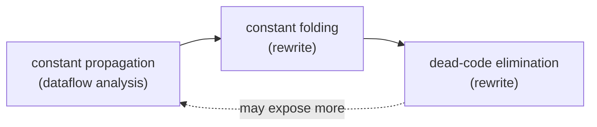

# Chapter 4: optimizations

This is the chapter where the analyses start paying off. Chapter 2 gave us SSA,
chapter 3 gave us a dataflow solver and liveness, and so far all of that just
computed facts and printed them. Here we use the facts to actually change the
code: work out which values are compile-time constants, fold them in, and then
delete whatever nobody reads anymore.

The optimization family this chapter is named after is bigger than what I build:
constant folding, SCCP, dead-code elimination, GVN, LICM. I'm going to be honest
about scope. Three of those fall straight out of what we already have, so I build
those end to end. The other two want machinery that isn't on the table yet, and
I'll say where they'd go rather than half-build them.

## A small pipeline

The three passes chain together, and the order matters:



Constant propagation is pure analysis: it figures out, at every program point,
which variables hold a value we can know at compile time. Folding is the rewrite
that consumes that analysis. DCE then mops up the instructions that folding
orphaned. The dashed edge back to the start is the honest part: one round of
folding can expose new constants, so a real compiler runs this loop until it
settles. I run each pass once here because that's enough for the example, but the
DCE pass itself does iterate to a fixpoint internally, for a reason I'll get to.

## The constant lattice

Constant propagation is just another instance of the chapter 3 solver. The only
new idea is the fact. Instead of a set of variables, the fact maps each variable
to a point on a three-level lattice:

- **top** — we haven't seen a definition reach this point yet. This is the
  optimistic starting guess, and it doubles as the solver's `top`.
- **Const(c)** — on every path that reaches here, this variable is exactly `c`.
- **bottom** — two paths disagree, or the value came from something we can't
  see at compile time (a function argument).

Meet pulls values *down* the lattice where control-flow edges join. `top` is the
identity, so meeting with it changes nothing. `bottom` is absorbing. Two
*different* constants meet to `bottom`, because if one predecessor says 50 and
another says 40, all we honestly know downstream is "some integer." That's
exactly what happens to `r` in the example: the two arms of the branch assign it
different constants, so at the join it drops to bottom.

This "only ever move down, and the lattice is finite" shape is the same
termination argument as liveness. The sets there only grew; here the lattice
points only fall. Either way the solver can't loop forever.

The transfer function walks a block's assignments, evaluating each right-hand
side over the lattice. The rule for a binary op: if any operand is still `top`,
stay `top` and wait; if any is `bottom`, the result is `bottom`; only when every
operand is a concrete constant do we compute the answer. An argument operand is
`bottom` from the start, which is why a condition like `p < c` stays a real
instruction even after we learn `c`.

## Folding, and why it enables deletion

Folding replays the lattice through each block and does two rewrites. Operands
that read a known-constant variable become immediates, and any assignment whose
result is constant collapses to a plain `copy` of that constant.

The collapse is the important half. Before folding, `c = mul a, b` reads `a` and
`b`. After folding it's `c = copy 42` and reads neither. That's what lets the
next pass delete `a` and `b`: folding doesn't remove anything itself, it just
severs the dependencies so that something downstream *can*.

## DCE finally uses liveness

Every operation in this IR is pure (no loads, no stores, no calls), so an
assignment is dead exactly when its result isn't live afterward. That's the
liveness from chapter 3, finally cashed in for something. I walk each block
backward from its live-out set, drop any assignment whose destination isn't live
at that point, and fold the reads of the kept instructions back into the live
set as I go.

Two subtleties bit me here. First, the terminator reads its condition or return
value *after* all the code in the block, so I have to seed the backward sweep
with those reads before touching the instructions, or the condition looks dead.
Second, deleting a use in one block can make a definition in another block dead
on the next round, and liveness computed before the deletion doesn't know that.
So DCE recomputes liveness and sweeps again until a round changes nothing. In the
example the whole `entry` block evaporates: once `c` folds to immediates
everywhere, nothing reads `a`, `b`, or `c`, and they all go.

## The code

[optimize.h](optimize.h) copies the IR, the solver, and liveness from chapter 3
unchanged, then adds:

- `CV` and `ConstMap`, the lattice point and the per-variable fact. The map is
  kept canonical (a variable at `top` is simply absent) so the solver's equality
  test stays cheap and honest.
- `constPropProblem` / `runConstProp`, the analysis as a forward, lattice-meet
  instance of `solve`.
- `foldConstants`, the rewrite that turns the analysis into immediates and
  copies.
- `deadCodeElim`, the liveness-driven sweep.

[main.cpp](main.cpp) builds a function with a foldable computation, a branch that
makes one value ambiguous, and a genuinely dead store, prints the constants the
analysis found, runs folding then DCE, and asserts the result down to the
surviving immediates.

## Build and run

```sh
g++ -std=c++17 -Wall -Wextra main.cpp -o ch04
./ch04
```

It prints the function, the constants known on each block's exit, then the
function after folding and DCE, then runs the asserts.

## Try it yourself

- **The missing iteration.** I run `foldConstants` and `deadCodeElim` once each.
  Build a case where one round isn't enough (a constant that only becomes visible
  after an earlier instruction is folded and deleted) and wrap the pair in a loop
  that runs until neither pass changes anything. The hard part is defining
  "changed" cleanly.
- **SCCP.** Sparse conditional constant propagation is the upgrade that makes this
  worth its name. In the example, if the branch condition itself folded to a
  constant, one arm would be unreachable, and ignoring it might turn a `bottom`
  back into a constant. SCCP tracks which CFG edges are reachable *in the same
  pass* as the constants, so the two reinforce each other. It doesn't fit the
  generic block solver cleanly because it needs a second worklist over edges;
  sketch how you'd thread reachability through `transfer`.
- **GVN.** Global value numbering attacks redundancy instead of constants: if two
  instructions compute the same thing from the same inputs, keep one. Give each
  computed value a number keyed by `(op, operand numbers)` and reuse it. This is
  much easier on the SSA form from chapter 2, where a value has exactly one
  definition; try it there.
- **LICM.** Loop-invariant code motion hoists a computation out of a loop when
  none of its inputs change inside the loop. That needs loop detection, which
  needs the dominators from chapter 2. Sketch the test for "invariant" and where
  the hoisted instruction has to land (the loop preheader) so it still dominates
  every use.
- A smaller one: extend folding to algebraic identities that constant
  propagation misses, like `x * 1`, `x + 0`, or `x - x`. These hold even when `x`
  is `bottom`, so they live in the rewrite, not the lattice.
