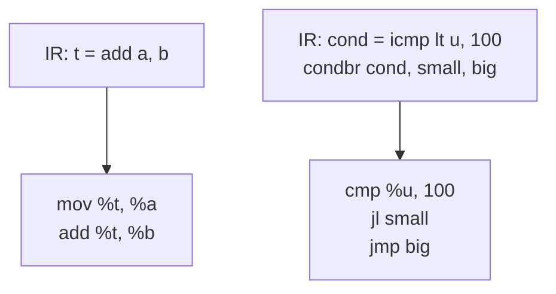

# Chapter 5: instruction selection

Up to now the IR has been a polite fiction. We wrote `add` and `icmp lt` and the
optimizations rewrote them, but nothing ever asked what a CPU does with them. The
answer is: not quite any of that. A real machine has its own instructions with
their own awkward rules, and instruction selection is the pass that picks machine
instructions to cover what the IR asked for. This is where the backend stops
being target-independent and commits to x86-64.

I want to be clear about what selection does and doesn't do here. It picks the
*instructions*. It does not assign real registers yet, so everything below still
runs on virtual registers, as many as we want. Squeezing those down to the
sixteen the hardware actually has is the next two chapters. And we don't pin the
return value to a particular register because we haven't met the calling
convention yet, so `ret` just carries its value along for chapter 9 to lower.

## What the machine makes awkward

Three IR things don't map one-to-one onto x86-64, and each one is a small lesson.

**Arithmetic is two-address.** The IR's `add` takes two inputs and a separate
output: `t = add a, b`. x86's `add` does not. `add %t, %b` means `%t = %t + %b`,
the destination is also the first source. So to select a three-address add I copy
the first input into the destination, then add the second in place. One IR
instruction, two machine instructions.

**Some operands can be immediates and some can't.** `add %u, 10` is a real
encoding: x86 arithmetic takes a 32-bit immediate. So when the second operand is
a constant I fold it straight in instead of loading it into a register first.
But the left side of a `cmp`, or the source of an `imul`, won't take an immediate,
so if one shows up there I have to materialize it with a `mov`. Knowing which slot
tolerates which kind of operand is most of what a selector's tables encode.

**There is no boolean.** `icmp lt u, 100` wants a 0-or-1 value. x86 doesn't
produce one directly. `cmp` sets the flags register as a side effect, and then you
either read those flags with a conditional jump (`jl`, "jump if less") or spill
them into a register with `setl`. Which one you want depends on what reads the
comparison.

That last point is where selection gets to be clever instead of mechanical.

## Tiling, and the one tile that pays off

The textbook framing of instruction selection is *tiling*: you have a tree of
operations and a set of machine-instruction-shaped tiles, and you cover the tree
with as few tiles as possible (maximal munch). Our IR is already linearized into
three-address instructions, not a tree, so most of what we do is plain expansion,
one IR instruction at a time. But the tiling idea still shows up the moment a tile
wants to span more than one IR node.

The case that matters: a compare whose only use is the branch right after it.



The naive expansion of the comparison is `cmp %u, 100` then `setl %cond`, and then
the branch has to load `%cond` and test it: `cmp %cond, 0` then `jne`. Four
instructions and a wasted register, all to recover information `cmp` already put
in the flags. If nothing other than the branch reads `cond`, I can fuse the two IR
nodes into one tile: `cmp %u, 100` then `jl small`. The flags flow straight from
the compare into the jump. That is a two-node tile beating two one-node tiles, the
whole point of maximal munch, in the one place it comes up in this IR.

The guard is "nothing other than the branch reads it." If some other instruction
also needed the boolean, fusing would throw away a value I still owe. So before
selecting I count the reads of every variable, and I only fuse when the compare's
result has exactly one reader. When it has more, the selector falls back to the
`setl` path. The example only exercises the fused path; the fallback is in the
code and the asserts confirm no `setl` was emitted.

## The code

[isel.h](isel.h) carries the IR and its printer forward from chapter 4, drops the
dataflow and optimization machinery (selection doesn't need any of it), and adds:

- A small machine layer: `MOp` (the opcode subset), `MOperand` (a virtual
  register, an immediate, or a branch label), and `MInst` / `MBlock` /
  `MFunction`. Operands print destination-first, the way Intel-syntax x86 reads.
- `Selector`, which holds the variable-to-virtual-register map and does the
  expansion. `selectAssign` handles one straight-line instruction; `selectBlock`
  decides on fusion and emits the terminator.
- `countReads`, the read-count pass the fusion test leans on, and
  `selectFunction`, which ties it together.

[main.cpp](main.cpp) builds a small function (the same shape as chapter 1's),
selects it, prints the IR and the machine code side by side, and asserts the
output down to specific instructions: the two-address expansion, the folded
immediate, the fused compare-and-branch, and the absence of any `setl`.

## Build and run

```sh
g++ -std=c++17 -Wall -Wextra main.cpp -o ch05
./ch05
```

It prints the IR, then the selected machine instructions on virtual registers,
then runs the asserts.

## Try it yourself

- **Force the fallback.** Add an instruction that also reads `cond` (say,
  returning it from a third block). Now its read count is 2, fusion is unsafe, and
  you should see `setl %cond` reappear plus a `cmp %cond, 0` at the branch. Add an
  assert for it.
- **More addressing tricks.** `mul` by a small constant is wasteful as an `imul`.
  `x * 2` is `lea %d, [%x + %x]` or a shift; `x * 8` is a shift by 3. Recognize a
  multiply by a power of two and emit a shift instead. This is a genuine tile: it
  matches a *pattern* (`mul` with a constant power-of-two operand), not just an
  opcode.
- **Fold a load-immediate-then-use.** Right now `t = add a, b; u = add t, 10`
  becomes four instructions. If `t` is read only by the next add, could the two
  collapse further? Think about what x86 actually allows here versus what would
  need a real three-operand form.
- **A second comparison.** Add `icmp eq` to the IR and selection. The fused branch
  becomes `je` instead of `jl`, and the `setl` fallback becomes `sete`. Notice the
  selector needs to remember *which* comparison it skipped so it can pick the
  matching jump.
- **Cost-based selection.** Maximal munch is greedy; it always takes the biggest
  tile. That isn't always cheapest. Sketch what would change if each tile had a
  cost and you picked the minimum-cost cover instead (this is the dynamic-program
  that real selectors like BURG run). You don't have to build it, just say where
  the greedy choice could lose.
