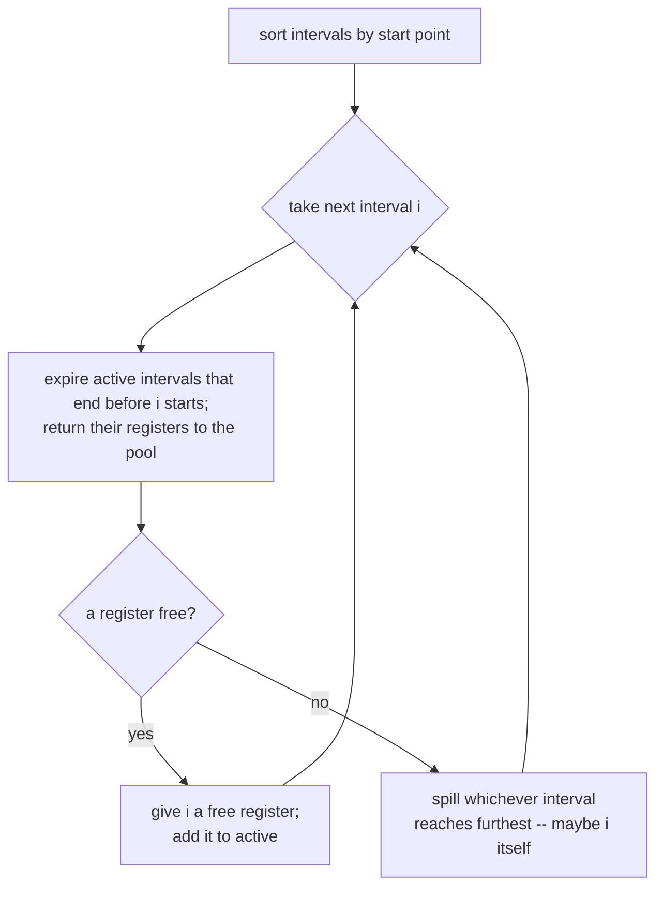

# Chapter 6: register allocation, part 1 (linear scan)

Selection gave us machine instructions, but I quietly cheated: every value still
lives in its own virtual register, and there are as many of those as the program
wants. A real CPU is not so generous. x86-64 has sixteen general-purpose
registers, and two of them are spoken for (the stack and frame pointers), so
realistically you have a dozen-ish to play with. Register allocation is the pass
that takes the unlimited virtual registers and crams them into that fixed set,
spilling whatever doesn't fit out to memory.

There are two classic ways to do this. Graph coloring is the thorough one and
gets a whole chapter to itself next. This chapter does the other one, linear
scan, which is what you reach for when you want allocation to be fast and the
result to be merely good. It's the allocator JITs tend to use, and it's a lot
easier to hold in your head.

## The one fact everything rests on

A value is *live* from the moment it's computed until the last time it's read.
Collapse that span down to a pair of instruction numbers and you get its **live
interval**. Here's the whole idea in one sentence: two values can share a
physical register exactly when their intervals don't overlap. If `a` is finished
being used before `b` is born, they never coexist, so they can take turns in the
same register.

So the plan is: number the instructions, work out each value's interval, then
sweep through the intervals left to right handing out registers, giving one back
the instant its interval ends so the next value can grab it.

I should be upfront about a simplification. Computing intervals from a plain
linear instruction order is only honest when the code really is linear. With
branches, a value live across one arm of an `if` can get an interval that's too
long or too short, and the proper fix is to feed in the liveness dataflow from
chapter 3 over a linearized CFG. To keep this chapter about the allocator and not
re-litigate liveness, the example is a single straight-line block, where the
instruction order *is* the truth.

## The scan

Walk the intervals in order of where they start. Keep a list of the ones
currently live (call it `active`), sorted by where they end. For each new
interval:

1. **Expire.** Drop any active interval that has already ended, and return its
   register to the free pool. This is the step that makes reuse happen.
2. **Assign or spill.** If a register is free, take it. If not, something has to
   go to memory. Pick the interval that reaches furthest into the future, since
   that's the one hogging a register the longest. If that's an already-active
   value, evict it and give its register to the newcomer; if the newcomer itself
   is the furthest-reaching, spill the newcomer instead.

That spill heuristic ("furthest endpoint loses") is the heart of linear scan.
It's a guess, not an optimum, but it's a good guess: kicking out the value you
won't need for the longest time is the same instinct as a cache eviction policy.



## Watching it run

The example computes `a*a + b*b + a*b`, plus a `base = a + b` that's set at the
top and not touched again until the last instruction. That `base` is the
troublemaker on purpose: it stays live across the entire function while five
other values come and go underneath it. Around the middle, `base`, `a`, `b`,
`m0`, and `m1` are all live and `m2` shows up wanting a sixth register. I only
give the allocator five.

So one value has to spill, and the heuristic picks `base` because it reaches
furthest. Everything else fits, and you can see registers getting recycled: once
`a` dies its register comes free and a later value moves in. The output prints
the intervals, the allocation decision per value, and then the rewritten code
with physical registers and a stack slot for `base`:

```
mov [rbp-8], %rbx     ; base = a + b, but base lives in memory now
add [rbp-8], %r11
...
add %r10, [rbp-8]     ; the one use of base, read back from the stack
```

A caveat I want to flag rather than paper over. Rewriting a spilled value
straight into a memory operand only works because `base` is only ever touched by
`mov` and `add`, and x86 is fine with a memory operand there. It would *not* be
fine with a memory operand on `imul`. In general a spilled value has to be
reloaded into a scratch register around each use, and emitting that spill code
correctly belongs with the rest of code generation in chapter 9. Here I let the
example stay in the lane where the naive rewrite happens to be legal, and the
asserts check that it landed where I claimed.

## The code

[regalloc.h](regalloc.h) carries the IR, the machine layer, and the selector
forward from chapter 5 unchanged, then adds the new parts at the bottom:

- `computeIntervals` flattens the function into one numbered stream and records,
  for each virtual register, the first and last position it appears at.
- `linearScan` is the algorithm above. The `active` list is a vector kept sorted
  by end point, so the spill candidate is always the last element. `Alloc` is the
  per-value verdict: a physical register, or a stack slot.
- `applyAllocation` rewrites the machine code in place, turning each virtual
  register into its assigned physical register or a `[rbp-N]` memory reference.

[main.cpp](main.cpp) builds the function above, selects it, runs the scan, and
prints the IR, the virtual-register machine code, the intervals, the allocation,
and the final allocated code. The asserts pin down the interesting facts: that
`base` is live across the whole function, that exactly one value spilled and it
was `base`, that the remaining eight values reused just five registers, and that
the rewrite put `base` in memory.

## Build and run

```sh
g++ -std=c++17 -Wall -Wextra main.cpp -o ch06
./ch06
```

## Try it yourself

- **Change the pressure.** Bump the pool in `kPool` to six registers and the
  spill disappears; drop it to four and a second value spills. Predict which one
  before you run it (hint: which interval reaches second-furthest at the crunch?)
  and check yourself against the output.
- **Spill that needs reload code.** Add an `imul` whose operand is the value that
  ends up spilled. Now the naive rewrite produces `imul %r, [rbp-8]`, which isn't
  a legal x86 instruction. Write a small pass that, after allocation, replaces a
  memory operand on `imul` with a reload into a scratch register first. This is a
  preview of the spill lowering in chapter 9.
- **A better spill choice.** "Furthest endpoint" ignores how *often* a value is
  used. A value read in a tight inner loop is a terrible thing to spill even if
  it lives a long time. Add a use count to `Interval` and break ties (or override
  the choice) by spilling the least-used long interval instead. Where does this
  help, and where could it now make a worse choice?
- **Two-pass reuse check.** After allocation, write a verifier that walks the
  code and asserts no two values with overlapping intervals were given the same
  register. This is the property the whole algorithm is supposed to guarantee, so
  it's worth being able to prove it held.
- **Handle a branch.** Give the function a second block and watch the linear
  interval computation get it subtly wrong. Then wire in the liveness sets from
  chapter 3 to fix the endpoints. This is the real bridge from the toy version to
  an allocator you'd actually ship.
