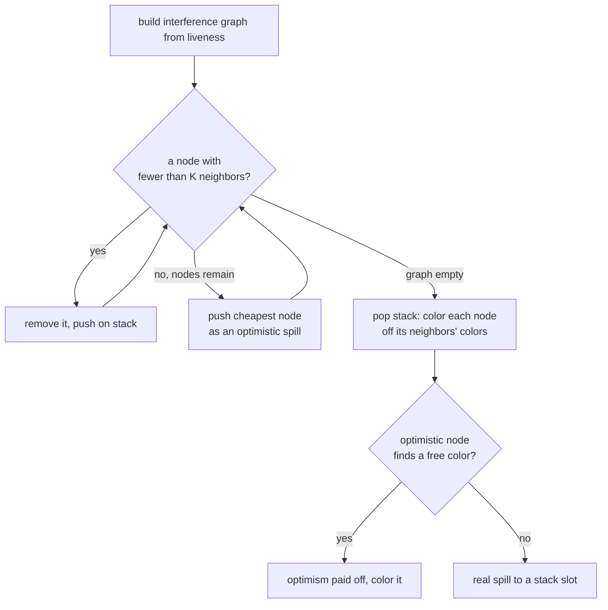

# Chapter 7: register allocation, part 2 (graph coloring)

Linear scan, from the last chapter, makes one pass over the instructions and
decides everything on the spot. It's quick and the output is fine, but it's
short-sighted: at the moment it runs out of registers it can only look at what's
active right now, and its spill rule is just "evict whatever reaches furthest."

Graph coloring throws that away and builds a single global picture instead. The
picture is the **interference graph**: one node per value, and an edge between two
values whenever they're alive at the same time, because then they can't share a
register. Once you have that graph, register allocation is literally graph
coloring -- assign each node one of K colors (K = the number of physical
registers) so that no edge joins two nodes of the same color. That global view is
what lets the allocator make a smarter spill choice, and it's the foundation for
coalescing copies later. It costs more to build and solve, which is the tradeoff:
JITs stay with linear scan, ahead-of-time compilers tend to pay for this.

## Building the graph

Two values interfere when one is defined while the other is still live. So I run
liveness (the same backward dataflow from chapter 3, narrowed to one fact), and
then walk each block backwards from its live-out set. At every definition I draw
an edge from the value being defined to everything still live at that point. The
operands being read at that same instruction aren't part of the result's
interference -- they were read, not held across the write -- so they don't get
spurious edges. That last detail is exactly what made the crude interval overlap
of chapter 6 imprecise, and it's why a real interference graph spills less.

There's one machine-shaped wrinkle I have to add by hand. x86 arithmetic is
two-address, so the selector lowers `d = u op v` into `mov d, u; op d, v`. That
writes `d` before it reads `v`. Reusing `u`'s register for `d` is fine (the `mov`
becomes a no-op), but if `d` landed on `v`'s register the second operand would be
clobbered before it's used. So the result interferes with its *second* operand. I
record that edge while building the graph.

## Coloring it: simplify and select

The algorithm is Chaitin-Briggs, and it's two passes over a stack.

**Simplify.** Find any node with fewer than K neighbors and pop it off the graph
onto a stack. The reasoning is neat: a node with fewer than K neighbors can always
be colored no matter what its neighbors get, since there'll be a spare color left,
so we can safely set it aside and deal with it later. Removing it shrinks
everyone else's degree, which often frees up more nodes. Repeat.

Eventually you might get stuck: every remaining node has K or more neighbors. Then
you have to nominate something to spill. I pick the cheapest node -- fewest uses,
breaking ties toward higher degree because removing a high-degree node unblocks
more of the graph -- and push it on the stack too, but marked as an *optimistic*
spill candidate. Optimistic because we haven't actually given up on it yet.

**Select.** Pop the stack back off. Each node gets a color none of its
already-colored neighbors are using. An ordinary node always finds one (that was
the invariant we maintained). The optimistic candidate might find one too: if its
neighbors happened to crowd onto fewer than K colors, a color is free and we got
that register for nothing. Only if all K colors are taken does it become a real
spill to a stack slot.



## Watching it run

The example is one straight-line block, built so the graph has a single tight
spot. Four values -- `L`, `s`, `x`, `y` -- are all live across the same
instruction, and I give the allocator only three registers. So those four form a
four-clique in the interference graph, and a four-clique can't be three-colored:
exactly one of them has to spill.

Here's the contrast with chapter 6. `L` is set at the top and read four more times
on the way down, so it's the longest-lived value. Linear scan, hitting the wall,
would spill `L` because it reaches furthest -- and then pay to reload it on each of
those four reads. Graph coloring weighs the whole clique and spills `s` instead,
which is read exactly once. Both choices relieve the same pressure; one costs four
reloads and the other costs one. That smarter spill is the payoff for building the
graph.

You can see it in the output: simplify peels off the easy nodes, gets stuck on the
clique, nominates `s`, and select confirms `s` can't be colored. The final code
puts `s` in a stack slot and everything else in `rbx`, `r12`, `r13`:

```
mov [rbp-8], 8        ; s lives in memory
...
add %rbx, [rbp-8]     ; its one use, read straight from the stack
```

Two honest caveats. First, on this single straight-line block the interference
graph is chordal, which is a fancy way of saying simplify alone never gets it
wrong on the colorable nodes and the optimistic spill candidate here genuinely
can't be saved -- the four-clique is real. Optimism only *rescues* a node when the
graph has a cycle without a chord, and those show up once you have branches and
real merges. I left building such a case as an exercise rather than dragging the
phi-node machinery in here. Second, the same spill-lowering caveat as last chapter
applies: dropping a spilled value into a memory operand is only legal because `s`
is touched by `mov` and `add`. A spill feeding `imul` would need a reload into a
scratch register first, and that lowering is chapter 9's job.

One more thing worth noticing in the allocated code: the `mov %rbx, %rbx`
self-moves. Those are copies whose source and destination got the same register.
They're dead, and deleting them is **coalescing** -- the other big reason to build
an interference graph. We don't do it yet, but you can see exactly where it would
bite.

## The code

[regalloc.h](regalloc.h) carries the IR, the machine layer, and the selector
forward from chapter 6 unchanged, then adds the new pieces at the bottom:

- `collectValues` / `countUses` give every value an id and a use count (the
  cheap stand-in for spill cost).
- `computeLiveness` is the backward dataflow fixpoint from chapter 3, specialized.
- `buildInterference` walks each block backward and draws the edges, including the
  two-address edge between a result and its second operand.
- `colorGraph` is simplify/select with optimistic spilling. The push order is the
  stack; `optimistic` records which nodes were spill candidates.
- `applyColoring` rewrites the machine code, looking each value up by name and
  substituting a physical register or a `[rbp-N]` slot.

[main.cpp](main.cpp) builds the function, prints the IR, the interference graph,
the coloring, and the before/after machine code. The asserts pin down the
interesting facts: that `L`, `s`, `x`, `y` really do form a clique, that exactly
one value spilled and it was the cheap one `s` (not the long-lived `L`, which
linear scan would have picked), that the coloring is valid (no two neighbors share
a color), and that after the rewrite `s` lives in memory.

## Build and run

```sh
g++ -std=c++17 -Wall -Wextra main.cpp -o ch07
./ch07
```

## Try it yourself

- **Change the pressure.** Give the allocator a fourth register (`kPool`) and the
  spill vanishes -- the four-clique is now four-colorable. Drop it to two and watch
  a second value spill. Predict which one from the use counts before you run it.
- **Make optimism actually pay off.** This is the big one. Add a second block and a
  branch so two values are live on different arms and the interference graph picks
  up a chordless four-cycle (a square with no diagonal). With K = 2, simplify gets
  stuck on all four, but the optimistic candidate's two neighbors are non-adjacent,
  so they share a color and it slips in without spilling. You'll need to handle the
  liveness across the branch (wire in the sets from chapter 3) for the graph to
  come out right. This is the case that justifies the whole "optimistic" idea.
- **Coalesce the self-moves.** Before coloring, find every copy `d = copy u` whose
  ends don't interfere and merge the two nodes into one, so they're forced to the
  same color and the copy becomes a no-op you can delete. The careful version
  (Briggs's conservative test: only coalesce if the merged node still has fewer
  than K high-degree neighbors) keeps you from accidentally making the graph
  uncolorable. This is the feature that makes graph coloring genuinely beat linear
  scan on real code.
- **A real spill cost.** "Fewest uses" ignores loops. A value used once inside a
  hot loop is far worse to spill than one used three times at the top level. Weight
  each use by `10^(loop depth)` and re-run; see which victim changes.
- **Prove it's correct.** Write a checker that walks the allocated machine code and
  asserts no instruction reads a register that was clobbered by a value it
  interferes with. It's the property the whole chapter is supposed to guarantee,
  and the two-address edge is the subtle part it should catch if you remove it.
