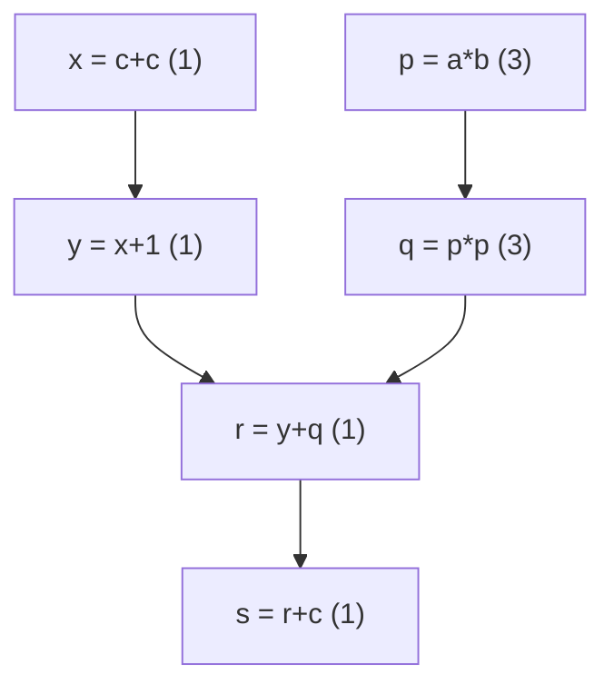

# Chapter 8: scheduling and peephole

At this point the pipeline produces working machine code. The selector picked the
instructions, the allocators put every value in a register or a stack slot. What's
left is that the code is in whatever order the selector happened to emit it, and
it's dotted with small local waste. This chapter is two cleanup passes that fix
those two things: instruction scheduling reorders within a block, and peephole
rewrites tiny patterns in a sliding window.

Neither pass changes what the code computes. They only change how fast it runs and
how much of it there is. That makes them a nice pair to end on, because the
correctness bar is simple to state -- same result, fewer stalls, fewer
instructions -- and I can actually check it by running the code.

## Why reorder at all

A modern CPU is pipelined: it starts an instruction before the previous one
finishes. That works right up until an instruction needs a result that isn't ready
yet, and then it stalls and waits. Different instructions take different numbers of
cycles -- an add is quick, a multiply is several cycles -- so the order you issue
them in changes how much waiting happens.

Here's the block I use. The number after each line is a stand-in latency; imagine
the multiply takes three cycles and everything else takes one.

```
x = c + c    (1)
y = x + 1    (1)
p = a * b    (3)   <- slow, and independent of the x/y chain
q = p * p    (3)
r = y + q    (1)
s = r + c    (1)
```

The selector emitted the cheap `x`/`y` adds first and the slow multiply chain
after. Run in that order, the processor breezes through the adds, then hits the two
multiplies back to back at the end and stalls on each. But `p = a * b` doesn't
depend on the adds at all. If we start it first, it's already churning away while
the adds run, and by the time we need `q` it's ready. Same instructions, less
waiting. That reordering is what the scheduler does.

## The dependence graph

I can only reorder instructions that don't depend on each other, so the first job
is to work out which ones do. Two instructions are ordered when they touch a common
location the wrong way round: one writes what the other reads (a true dependence),
one writes what the other read (an anti-dependence), or both write it (an output
dependence). Draw an edge for every such pair and you get a DAG. Any topological
order of that DAG computes the same thing as the original.



The two chains are independent until they meet at `r`. The longest path to the
bottom, weighted by latency, is `p -> q -> r -> s` at 3+3+1+1 = 8, versus the add
chain's 1+1+1+1. That longest weighted path is the **critical path**, and it's the
real lower bound on how fast the block can finish. So the scheduling heuristic
almost writes itself: whenever more than one instruction is ready to go, pick the
one sitting on the longest critical path, because delaying it delays everything
hanging off it.

That's list scheduling. Keep a set of *ready* instructions -- the ones whose
predecessors in the DAG have all been placed -- and repeatedly emit the ready one
with the highest critical-path number, which frees up its successors. I compute the
critical path with a single backward pass, which works because I only ever draw
edges from a lower index to a higher one, so program order is already a topological
order to sweep in reverse.

## The catch: this runs after allocation

There's a decision buried in *when* you schedule, and it bit me while writing this.
The freest place to reorder is before register allocation, when every value still
has its own virtual register and the only edges are real data dependences. But if
you reorder there and allocate afterward, the allocator's liveness is computed for
the *new* order, and the allocator I carried from chapter 7 computes liveness from
the IR, which is still in the old order. Do that and you get code that looks fine
and computes garbage -- I hoisted a multiply over an add that shared a register with
it, and the multiply clobbered a value the add still needed.

So I run scheduling as a post-pass, on the allocated code, over physical registers.
Now the reuse the allocator introduced shows up honestly in the dependence graph:
if the multiply's result register is one the add chain reads, there's an
anti-dependence edge and the scheduler simply won't cross it. Every topological
order is correct by construction. The price is less freedom -- register reuse pins
instructions that were independent before allocation -- which is the classic
tension between these two passes and a whole research area on its own. I keep `c`
live to the end of the example specifically so its register can't be recycled into
the multiply, which is what leaves the hoist legal.

## Peephole

The second pass is much simpler: slide a small window along the final instruction
stream and rewrite local patterns. Two kinds show up here. Identities that delete an
instruction outright -- `add r, 0`, `imul r, 1`, and the big one, `mov r, r`. And
strength reductions that swap a slow op for a fast one, like `imul r, 2` becoming
`add r, r`.

The self-moves are the ones chapter 7 flagged and left on the table. A `mov` whose
source and destination got colored the same register does nothing, and after
two-address lowering there are a lot of them. Deleting them is the poor man's
coalescing: we didn't merge the copy nodes during coloring, but we can still sweep
up the copies they leave behind. It's not as good as real coalescing (that removes
the interference too, which can change the coloring), but it's most of the payoff
for a few lines of code.

## Watching it run

The allocated block comes out in program order with the multiply chain at the
bottom and a scattering of self-moves. Scheduling pulls the multiply up front:

```
imul %rbx, %r12      ; the multiply, now first
mov  %r14, %r13
mov  %r12, %rbx      ; its second step, interleaved with the adds
add  %r14, %r13
imul %r12, %rbx
...
```

The two chains are interleaved instead of run one-then-the-other, so the multiplies
are in flight while the adds compute. Peephole then deletes the self-moves that
allocation left behind.

The check I trust most here is the little interpreter in [main.cpp](main.cpp). It
evaluates the block for concrete inputs and confirms the answer is the same after
allocation, after scheduling, and after peephole. That's the property both passes
are supposed to preserve, and it's exactly what caught the reorder bug above -- the
structural asserts were all green while the code was quietly wrong.

## The code

[schedule.h](schedule.h) carries the IR, machine layer, selector, and the whole
graph-coloring allocator forward from chapter 7, then adds:

- `resourcesOf` says what each machine instruction reads and writes, in terms of
  named locations (registers by name, plus `flags` and one conservative `mem`).
- `buildDAG` draws the RAW/WAR/WAW edges and computes each node's critical path.
- `listSchedule` is the ready-list scheduler, picking longest-critical-path first.
- `planSchedule` / `applySchedule` split a block's body from its terminator,
  schedule the body, and leave the branch or ret fixed at the end.
- `peepholeBlock` is the sliding-window rewriter.

[main.cpp](main.cpp) builds the block, allocates it, prints the critical-path
numbers, schedules, and peepholes, printing the code at each step. The asserts pin
down that the schedule is a valid topological order (so it can't have broken a
dependence), that the multiply really got hoisted, that the self-moves are gone,
and -- via the interpreter -- that the result never changed.

## Build and run

```sh
g++ -std=c++17 -Wall -Wextra main.cpp -o ch08
./ch08
```

## Try it yourself

- **Change the latencies.** Bump `latency` so `Add` also costs 2, or make `IMul`
  cost 5. Predict from the critical-path numbers which instruction leads before you
  rerun, then check.
- **Make the anti-dependence bite.** Drop the final `s = r + c` so `c` dies early.
  Now the allocator can hand the multiply `c`'s register, the scheduler sees the
  anti-dependence, and the hoist disappears. This is the register-pressure-limits-
  scheduling effect in miniature -- watch the interpreter still return the right
  answer either way.
- **Schedule before allocation, properly.** Move the scheduling pass ahead of
  allocation and make it correct: you'll need a liveness pass that runs on the
  scheduled machine code rather than on the IR. This is the more powerful ordering,
  and doing it is the honest way to get the freedom I gave up.
- **A real peephole window.** All my rules look at one instruction. Add a
  two-instruction rule: `mov a, b` immediately followed by `mov b, a` -- the second
  is redundant, drop it. Then convince yourself it's only safe when nothing wrote
  `a` in between.
- **Bigger blocks, resource limits.** Real schedulers also model that the CPU can
  only issue so many instructions per cycle and has a fixed number of multiply
  units. Add a cap of one multiply started per cycle and see how the schedule
  spreads the two imuls apart.
